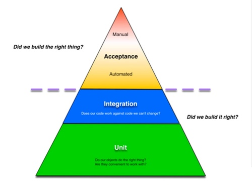

Kanban
======

This project implements a simple Kanban tool in a browser. It predominately borrows from the coding work of Juho 
Vepsäläinen in support of his excellent book 
*[SurviveJS Webpact and React; from Apprentice to Master](https://leanpub.com/survivejs_webpack_react)*. Please support 
his work! He has much more in store to write on JS development; let's kept it going with purchasing that book. He is 
very good about updating it! 

Juho's ([@bebraw](https://twitter.com/bebraw?lang=en)) 
[GitHub Code Repository](https://github.com/survivejs/webpack_react) for *SurviveJS Webpack and React*. 

A very active [Gitter Chat](https://gitter.im/survivejs/webpack_react) dedicated to the book. Juho is very supportive on 
this Gitter Chat! 

My personal additions to his body of work captured within this repository focus on note gathering (below) and exploring 
[UT](#react-uting)/[Integration](#integraton-testing)/[Acceptance](#end-to-end-acceptance-testing) testing beyond Juho's 
introductory work on the testing subject. 

NPM
---

| NPM Command | Wot it do                                                                       |
|:------------|:--------------------------------------------------------------------------------|
| install     | Install packages. *See [install](https://docs.npmjs.com/cli/install)*           |
| prune       | removes packages that are not listed on the parent package's dependencies list. |
| dedupe      | Reduce duplication of dependencies                                              |
| shrinkwrap  | Lock down dependency versions

WebPack
-------

[Debug webpack in WebStorm, IDEA](https://blog.jetbrains.com/webstorm/2015/09/debugging-webpack-applications-in-webstorm/)

| Dev Package                                 | Reason                                                                                                                              |
|:--------------------------------------------|:------------------------------------------------------------------------------------------------------------------------------------|
| npm-install-webpack-plugin                  | Detects new 'require' addition in code and automatically installs & saves (npm) package.                                            |
| html-webpack-plugin & html-webpack-template | Creates new index.html on each build updating JS script inclusions.                                                                 |
| clean-webpack-plugin                        | Purge 'build' directory prior to each build.                                                                                        |
| jscs-loader[^1]                             | Runs your source through the [JSCS style checker](http://jscs.info/).                                                               |
| css-loader                                  | css loader module for webpack.                                                                                                      |
| less-loader                                 | less loader module for webpack                                                                                                      |
| sass-loader                                 | sass loader module for webpack                                                                                                      |
| node-sass                                   | provides binding for Node.js to LibSass, the C version of the popular stylesheet preprocessor, Sass.                                |
| extract-text-webpack-plugin                 | Extract latent styling into CSS/LESS/SASS files; avoid the [FOUC](https://en.wikipedia.org/wiki/Flash_of_unstyled_content) problem. |

To run stats:
> ```% npm run stats```

A ```stats.json``` will have been created that can be uploaded to analyze [here](http://webpack.github.io/analyse/#home) or [here](http://chrisbateman.github.io/webpack-visualizer/)

| App Package                                                               | Reason                                                                                     |
|:--------------------------------------------------------------------------|:-------------------------------------------------------------------------------------------|
| autobind-decorator                                                        | Provides @autobind to bind 'this' to the annotated method.                                 |
| deep-freeze-node[^1]                                                      | Make an entire data structure immutable.                                                   |
| [seamless-immutable](https://github.com/rtfeldman/seamless-immutable)[^1] | Immutability that caters to ReactJS state updating.                                        |
| react-dnd                                                                 | [Drag 'n Drop for React](https://gaearon.github.io/react-dnd/)                             |
| react-input-field[^1]                                                     | carefully crafted [input field for React](https://www.npmjs.com/package/react-input-field) |
| react-datagrid[^1]                                                        | carefully crafted [DataGrid for React](http://zippyui.com/react-datagrid/#/)               |
| react-combo[^1]                                                           | carefully crafted [DropDown for React](https://github.com/zippyui/react-combo)             |

React
=====

React [Best Practices](https://blog.risingstack.com/react-js-best-practices-for-2016/)

React Form Validation
---------------------

From Juho:

> JSON Schema shines in certain type of apps; you can even serve the schema from server -> single place for validation 
> rules. Here's a good implementation https://github.com/ismaelga/react-json-editor 

> [tcomb-form](https://gcanti.github.io/tcomb-form/) is a schema-based solution.

Notes on validation

* Determine which state you need to represent the form. Input values and error messages are the obvious ones to start 
  with, but you may need others at a minimum, such as checkng whether a field has been interacted with yet. 
* Write a render() method which uses that state.
* Hook up event handlers which update the state as necessary when form input changes.
* The fun starts when you realise you need to use the same valiation code at different times. For onChange/onBlur, you 
  need to be able to validate fields and update the related state individually. For onSubmit validation, you need to be 
  able to validate every field. 
* Cross-field validation adds to the fun, as does async validation, debouncing inputs and being able to show soft 
  warnings rather than validation errors. Browsers auto-populating fields just adds cruelty when you thought you were 
  done. 
* Depending on how complex your form is, you may not encounter/need all this.
[The proposal for the upcoming rewrite of redux-form](https://github.com/erikras/redux-form/issues/726) is an interested 
read related to form validation in React, as it describes two ways to do lots of different things you you need to do to 
handle forms (the old API and the new). [react-formal](https://github.com/jquense/react-formal) is also interesting as a 
schema-based approach to form validation. Even if you're not using form libraries, they're solving the same problems 
you'll be encountering soon. 

[Redux](http://redux.js.org/index.html)
-----

Juho Vepsäläinen's state solution is [Alt](http://alt.js.org/). However, my interests lie with Redux. For the time 
being, this section is a collection notes on Redux. 

[Redux Documentation](http://redux.js.org/docs/introduction/Motivation.html)

Dan Aberamov's [video lessons on Redux](https://egghead.io/series/getting-started-with-redux).

#### Redux Notess

| Package | Reason                                                                                                                        |
|:-------------|:------------------------------------------------------------------------------------------------------------------------------|
| redux-react  | [static analysis of ES6 modules ](https://www.npmjs.com/package/analyze-es6-modules) determining if imports and exports align |


#### With Redux, is fb's [immutable.js](https://facebook.github.io/immutable-js/) necessary?

Blog Posts that support augmenting Redux's immutability with immutable.js or, better yet, 
[seamless-immutable.js](http://seemless-immutable.js/): 

> Q: Is it really necessary to use Immutable.js? According to official documentation reducer function in Redux should 
> always emit a new state object using Object.assign(), so why is there need for such a huge library? 
    
> A: It is not necessary to use Immutable.js, but then you have to be really careful and know exactly how you 
> calculate and return reducer state. Not to mention it looks unreadable and hard to maintain with all pre/post slicing 
> of the arrays --> http://redux.js.org/docs/basic... and these are just simple examples. Also since ImmutableJS has 
> versatile API, in most cases it removes the need for helper libraries like lodash. 

- [Full-Stack Redux Tutorial](http://teropa.info/blog/2015/09/10/full-stack-redux-tutorial.html)
- [React, Redux and Immutable.js: Ingredients for Efficient Web Applications](https://www.toptal.com/react/react-redux-and-immutablejs)

#### [Redux Thunks](https://github.com/gaearon/redux-thunk)

> Redux Thunk middleware allows you to write action creators that return a function instead of an action. The thunk 
> can be used to delay the dispatch of an action, or to dispatch only if a certain condition is met. The inner function 
> receives the store methods dispatch and getState as parameters. 
  
- Long StackExchange [answer from Abermov on dealing and testing Redux Thunks](http://stackoverflow.com/questions/35411423/how-to-dispatch-a-redux-action-with-a-timeout/35415559#35415559).

#### [Redux Saga](http://yelouafi.github.io/redux-saga/) as an alternative to of Redux Thunks.

> "Redux Saga is a co-processing library for listening to actions, spawning background work, and dispatching results, 
> ideal for HTTP requests and other side effects" 

- GitHub Issue #70 [discussion on documenting Redux Saga](https://github.com/yelouafi/redux-saga/issues/70)

testAllTheThings()!
-------------------


Tests help understand code written a month prior better than code comments ever will&hellip;
 


The testing pyramid indicates that a project should invest an overwhelming majority of effort into the Unit Testing and 
the Integration (service) testing with a focus on them running very fast. A smaller effort is extended into the 
'Acceptance' level of End-to-End testing. Meaning, acceptance is probably limited to a 'greased path' test of a story 
that may be integrated into a suite of other page-related or other flow-related tests. Even if acceptance tests are 
limited to 'greased path' scenarios, they could easily become a significant investment over time. It is a central goal 
for Acceptance Test to be as easy as possible to both craft and maintain. They can't consume a developer's time at the 
cost of sprint delivery or more important testing at the UT and integration levels. Let's watch and learn... 

With a ReactJS design, I am expecting that a lot of bugs are going to be avoided that require EtoE web drivers to find 
and protect against regression. In addition, I expect that ReactJS it will lend itself to UT patterns that are more 
straightforward even for testing error paths (not 'greased path). 
 
So, lets concentrate on ReactJS UT testing alternatives first prior to getting to the numerous 'Acceptance', web driving 
alternatives. 



[Automated Testing Best Practices](https://github.com/xolvio/automated-testing-best-practices#automated-testing-best-practices-by-xolvio)

### React UT'ing
    
#### React Component UT'ing

[Enzyme](https://github.com/airbnb/enzyme)[^1] looks like the way to attack testing components. Enzyme is a JavaScript 
Testing utility for React that makes it easier to assert, manipulate, and traverse your React Components' output. 
 
 Approach options (old). [Oh, the options!](http://reactkungfu.com/2015/07/approaches-to-testing-react-components-an-overview/)

If using React's shallow rendering feature for UT'ing components, it is still probably best to look to ```enzyme```, but 
[skin-deep](https://github.com/believer/react-testing-skin-deep) might be a package that eases dealing with shallow. 
Posts on using ```skin-deep```: 

- [Unit testing React components without a DOM](https://simonsmith.io/unit-testing-react-components-without-a-dom/)
- [React testing with shallow rendering and skin-deep](http://willcodefor.beer/react-testing-with-shallow-rendering-and-skin-deep/)

Enzyme supports integration with testing frameworks:

- [Enzyme w/ Mocha](https://github.com/airbnb/enzyme/blob/master/docs/guides/mocha.md) - Enzyme was originally designed 
  to work with Mocha. 
- [Enzyme with Karma](https://github.com/airbnb/enzyme/blob/master/docs/guides/karma.md)

Enzyme [integration into a Webpack build](https://github.com/airbnb/enzyme/blob/master/docs/guides/webpack.md).

Using [Karma with WebPack](http://mike-ward.net/2015/09/07/tips-on-setting-up-karma-testing-with-webpack/)

[Testing in ES6 with Mocha and Babel 6](http://jamesknelson.com/testing-in-es6-with-mocha-and-babel-6/)

[Karma vs Mocha/JSDOM](https://medium.com/podio-engineering-blog/from-karma-to-mocha-with-a-taste-of-jsdom-c9c703a06b21#.87qy2mwxa)  

#### Testing Stores

[Mocha Testing Redux](https://www.codementor.io/reactjs/tutorial/redux-unit-test-mocha-mocking)[^1]

Testing [Redux Saga](http://yelouafi.github.io/redux-saga/docs/advanced/Testing.html)

### Integration Testing

[RestAssured](https://github.com/jayway/rest-assured/wiki/Usage)[^1] 

### Test Package List

| Test Package                            | Reason                                                                                                                        |
|:----------------------------------------|:------------------------------------------------------------------------------------------------------------------------------|
| analyze-es6-modules[^1]                 | [static analysis of ES6 modules ](https://www.npmjs.com/package/analyze-es6-modules) determining if imports and exports align |
| eslint                                  | [Pluggable static code analysis (linting) utility for JavaScript.](http://eslint.org/)                                        |
| eslint-plugin-react                     | React specific linting rules for ESLint.                                                                                      |
| expect                                  | expect is a more compact alternative to Chai or Sinon.JS.                                                                     |
| expect-jsx                              | toEqualJSX for mjackson/expect. Can to turn React elements into JSX strings.                                                  |
| babel-eslint                            | ESLint using Babel as the parser.                                                                                             |
| generator-react-cdk                     | React CDK *creats* React boilerplate. React-CDK tool versions are maintained by author.                                       |
| isparta-instrumenter-loader             | Instrument Babel code using IsParta; leverages [Istanbul](https://github.com/gotwarlost/istanbul)                             |
| react-addons-test-utils                 | Tools to assist testing React.                                                                                                |
| react-dnd-test-backend                  | [Test React Dnd](http://gaearon.github.io/react-dnd/docs-test-backend.html).                                                  |
| legit-tests[^1]                         | Replacement for ```react-addons-test-utils```                                                                                 |
| redux-mock-store[^1]                    | [Test Redux stores](https://github.com/reactjs/redux/blob/master/docs/recipes/WritingTests.md).                               |
| karma                                   | [Karama](http://karma-runner.github.io/0.13/index.html)                                                                       |
| karma-coverage                          | Karma adapter to run Istanbul code coverage.                                                                                  |
| karma-babel-preprocessor                | Preprocessor to compile ES6 on the fly with Babel.                                                                            |
| karma-mocha                             | Karma adapter to leverage Mocha. *See 'mocha' below&hellip;*                                                                  |
| karma-chai                              | Karma adapter to leverage Chai. *See 'chai' below&hellip;*                                                                    |
| karma-phantomjs-launcher                | Karma PhantomJS launcher.                                                                                                     |
| karma-firefox-launcher                  | Karma Firefox launcher.                                                                                                       |
| karma-chrome-launcher                   | Karma Chrome launcher.                                                                                                        |
| karma-ie-launcher                       | Karma IE launcher.                                                                                                            |
| karma-sourcemap-loader                  | Allows Karma to load source maps from transpiled Babel code.                                                                  |
| karma-spec-reporter                     | Test reporter, that prints detailed results to console.                                                                       |
| karma-webpack                           | The link between the two.                                                                                                     |
| karma-webpack-with-fast-source-maps[^1] | Fork of ```karma-webpack```. *One or the other!*                                                                              |
| enzyme[^1]                              | Testing utility for React that makes it easier to assert, manipulate, and traverse your React Components output.              |
| chai-enzyme[^1]                         | Chai assertions for ```enzyme```                                                                                              |
| mocha                                   | A feature-rich [JavaScript test framework](https://mochajs.org/) that simplifies async testing.                               |
| codeceptjs[^1]                          | With [CodeceptJS](http://codecept.io/), acceptance tests from user's perspective can be written.                              |
| chai                                    | A BDD / TDD [assertion library](http://chaijs.com/).                                                                          |
| jsx-chai                                | JSX assertions for Chai using Algolia's react-element-to-jsx-string.                                                          |
| react-unit[^1]                          | Obviates the need for PhantomJS.                                                                                              |
| phantomjs-prebuilt                      | Installer for PhantomJS, headless webkit with JS API.                                                                         |
| phantomjs-polyfill                      | Polyfill for ```function.prototype.bind``` missing from PhantomJS.                                                            |

### End-to-End Acceptance Testing

I am of the opinion that if an organization invests in Acceptance testing, it should be done by the UI developer team, 
not a dedicated 'test' team. If the members of the test team are JavaScript programmers, then cool. My team has a 
dedicated test team crafting Acceptance tests. You can find my 
[treatise on that subject here](https://gkedge.gitbooks.io/javascript-acceptance-testing/content/). 
 
#### [SeleniumHQ](http://docs.seleniumhq.org/)
Every solution considered for this project at this point leverages Selenium **'servers'**. The reason for quoting 
'servers' is running a Selenium server, though easy, can be a tad confusing. A central truism for all Selenium 'servers' 
is that they all provide a HTTP ReST API that leverages JSON-formatted data for all payloads and responses. That protocol 
used to communicate between a test clients and Selenium Server has been standardized as the 
[W3C WebDriver Standard](https://w3c.github.io/webdriver/webdriver-spec.htmlJSON) (formerly known as, the 
[JSON Wire Protocol](https://github.com/SeleniumHQ/selenium/wiki/JsonWireProtocol) and, for this README, referred to as 
The Protocol). 
 
##### The Java Selenium Standalone Server

Selenium supplies a Java server that can drive Firefox (only!). However, it's use (and it's associated Java install) is 
absolutely necessary only when running Selenium on remote server hardware (relative to the test client)! If you have 
Java installed locally, you **can** use to to drive Firefox without further plugin dependencies. Please see 
[this to download the Java Selenium Standalone Server](http://www.seleniumhq.org/download/). *To simplify instructions 
that follow, put the selenium-server-standalone-2.xx.0.jar into a 'lib' folder in this project.* 

##### Dedicated Binary Browser Servers
 
For each browser, there is a binary (native executable available for Linux, Windows, & OS X) that can both drive their 
related browser **and** act as a browser-dedicated, local Selenium server. As an example, Google Chrome maintains 
```ChromeDriver``` to drive Chrome. It can be run locally to serve test clients running on the same hardware/OS. Even 
though Firefox is supported by the Java Selenium Standalone Server, Mozilla maintains a Firefox WebDriver called 
[Marionette](https://developer.mozilla.org/en-US/docs/Mozilla/QA/Marionette). 

If you are running a server remotely (the only way to test different browsers concurrently), that remote server must 
have the Java Selenium Standalone Server installed (along with Java itself) in addition to the binary driver dedicated 
to the browser type to be tested on that server. The lone exception would be Firefox where you would have a choice of 
installing Marionette or reallying upon the Java Selenium Standalone Server alone. 

Though Selenium servers support all popular browsers (&hellip; and some *unpopular*), a single running Selenium server 
can only interact with a single version of a single browser. SeleniumGrid and other like-efforts are available to test 
multiple browsers in parallel upon kicking off a test. 

*Supported popular browsers*

| Browser WebDriver                                                                      | Maintainer | Versions       |                                                                                      |
|:---------------------------------------------------------------------------------------|:-----------|:---------------|:-------------------------------------------------------------------------------------|
| [ChromeDriver]((https://sites.google.com/a/chromium.org/chromedriver/))                | Google     | All Versions   | [Download](https://sites.google.com/a/chromium.org/chromedriver/downloads)           |
| Firefox (Java Standalone)                                                              | Selenium   | 4 and newer    | [Download](http://www.seleniumhq.org/download/)                                      |
| Firefox ([Marionette](https://developer.mozilla.org/en-US/docs/Mozilla/QA/Marionette)) | Mozilla    | All Versions   | [Download](https://developer.mozilla.org/en-US/docs/Mozilla/QA/Marionette/WebDriver) |
| IEWebDriver                                                                            | Selenium   | 6 to 10        | [Download](http://www.seleniumhq.org/download/)                                      |
| IEWebDriver for IE 11                                                                  | Microsoft  | 11             | [Download](https://www.microsoft.com/en-us/download/details.aspx?id=44069)           |
| Opera                                                                                  | Opera      | 10.5 and newer |
| Safari                                                                                 | Selenium   | 5.1 and newer  | [Download](http://www.seleniumhq.org/download/ )                                     |

*Supported specialized browsers; browsers used in development environments.*

| Driver Name     | Purpose                                        | Maintainer          |
|:----------------|:-----------------------------------------------|:--------------------|
| PhantomJSDriver | Headless PhantomJS browser backed by QtWebKit. | GhostDriver project |
| HtmlUnitDriver  | Headless browser emulator backed by Rhino.     | Selenium project    |


#### WebDriver Installation

Download one of the Browser WebDrivers from the table above and run. You may wish to put the downloaded WebDriver in 
your $PATH (no, I'm not showing you how to do that). If your WebDriver of interest is ChromeDriver and it is in $PATH: 

```
    % chromedriver --port=4444 --url-base=/wd/hub --verbose=1
      Starting ChromeDriver 2.21.371459 (36d3d07f660ff2bc1bf28a75d1cdabed0983e7c4) on port 4444
      Only local connections are allowed.
```
> *There’s a bug with chromedriver on OSX Mavericks that can be fixed by running in verbose mode.*

Note the port (here for chromedrive, it is 4444). Your chosen client will have to know the port your Selenium server is 
bound. 

##### SeleniumHQ IDE
SeleniumHQ provides a specialized IDE that records a user's activity to capture a scripts that can run within its 
client. I am avoiding this tact and focusing on manually created tests leveraging PageObjects to ensure a less-brittle 
test suite. [Please read this for why.](http://code.tutsplus.com/articles/maintainable-automated-ui-tests--net-35089). 

#### Selenium Clients

Client access to a Selenium server (and it's bound binary browser-specific plugin) can be written in any programming 
language. This is possible given that language-agnostic nature of The Protocol. 

##### Client W3C WebDrivers

SeleniumHQ provides language-specific libraries (gems, packages, &hellip;) that implement the client-side W3C WebDriver 
protocol. However, their test API can leave something to be desired compared to 3rd party offerings. 

*SeleniumHQ Language-specific Client Binding Libraries (gems, packages, &hellip;)*

| Language          |                                                                                            |
|:------------------|:-------------------------------------------------------------------------------------------|
| Java              | [Download](http://selenium-release.storage.googleapis.com/2.53/selenium-java-2.53.0.zip)   |
| C#                | [Download](http://selenium-release.storage.googleapis.com/2.53/selenium-dotnet-2.53.0.zip) |
| Ruby              | [Download](http://rubygems.org/gems/selenium-webdriver)                                    |
| Python            | [Download](http://pypi.python.org/pypi/selenium)                                           |
| Javascript (Node) | [Download](https://npmjs.org/package/selenium-webdriver)                                   |

While those are the *official* language bindings supported by SeleniumHQ, there are other 
[3rd Party bindings available](http://www.seleniumhq.org/download/#thirdPartyLanguageBindings). 3rd party bindings make 
a name for themselves by compensating for bugs in the servers and/or improving the testing interfaces that they expose 
to the developer. Of those available, I am only listing the JavaScript bindings. If a JavaScript binding proves worthy 
to a JS team, then the adoption could be that much more within reach. 

*3rd Party JS Client Packages*

| JS Package                                                 | Maintained by                                     |
|:-----------------------------------------------------------|:--------------------------------------------------|
| [WD.js](https://github.com/admc/wd)                        | Adam Christian                                    |
| [Yiewd](https://github.com/jlipps/yiewd) (a WD.js wrapper) | Jonathan Lipps                                    |
| [WebDriver.IO](http://webdriver.io/)                       | Camilo Tapia, Vincent Voyer and Christian Bromann |
| [Nightwatch](http://nightwatchjs.org/)                     | Andrei Rusu                                       |
| [LeadFoot](https://www.npmjs.com/package/leadfoot)         | SitePen (See Intern below.)                       |

##### JS Complete Client Testing Packages

All the JS packages listed in the above table with the exception of Leadfoot, provide unified improvements both to the 
test API exposed to the developer and The Protocol implementation. The test API my be proprietary or expose well known 
API's (e.g.: Mocha, Cucumber, etc.). Leadfoot prides itself on its focus on adding stability to The Protocol 
implementation by aggressively ferreting out and reporting server bugs and offering work-arounds until the servers are 
updated. For Leadfoot, is the tandem project Intern that exposes the testing API to the developer. 
                        
| Testing Packages                       | Maintained by |
|:---------------------------------------|:--------------|
| [Intern](https://theintern.github.io/) | SitePen       |

#### Java Client Programming
[Selenium Maven Archetype](https://github.com/sebarmeli/Selenium2-Java-QuickStart-Archetype) 

#### Grid / Parallel Testing

[Gridlastic; Selenium Grid in Cloud](https://www.gridlastic.com/)  
[Nightwatch in Gridlastic](https://www.gridlastic.com/nightwatch-js-example.html)  

#### App Hooks for Selenium Client Aquisition
Use [data-selenium-id](http://webdesign.tutsplus.com/tutorials/all-you-need-to-know-about-the-html5-data-attribute--webdesign-9642) to hook in Selenium.

#### Selenium Books

[Mastering Selenium Testing Tools](http://my.safaribooksonline.com/video/software-engineering-and-development/software-testing/9781783985487)[^2]  
[Mastering Selenium WebDriver](http://my.safaribooksonline.com/book/web-development/9781784394356) *NOTE: TestNG!*  
[Selenium Testing Tools Cookbook - Second Edition](http://my.safaribooksonline.com/book/software-engineering-and-development/software-testing/9781784392512) *NOTE: TestNG!  

#### [Nightwatch](http://nightwatchjs.org/)

Nightwatch [API](http://nightwatchjs.org/api)

| Selenium Test Package | Reason                                                                                      |
|:----------------------|:--------------------------------------------------------------------------------------------|
| nightwatch            | [Acceptance tests in Node.js](http://nightwatchjs.org/) that run against a Selenium server. |
| nightwatch-autorun    | Automatically installs Selenium (if necessary) and runs Acceptance tests with Nightwatch.   |

Nightwatch has a configuration file (nightwatch.json) for which connectivity to the Selenium server is established. 
Nightwatch can start and stop your Selenuum server, however I have found that Nightwatch can only control a WebDriver's 
lifetime if the Java Selenium Standalone server is used as a pass-through to the browser-dedicated binary, even if 
running locally. 

If you want Nightwatch to control the Selenium Server's lifetime:

 - follow instructions above to install the The Java Selenium Standalone Server and
 - provide the following Selenium configuration to nightwatch.json:
 
```
 {
   ...
   "selenium": {
     "start_process": true,
     "server_path": "lib/selenium-server-standalone-2.xx.0.jar",
     "log_path": "integration/log"
   },
   ...
 }
```

If you can forgo having Nightwatch control the Selenium Server's lifetime, starting/stopping it manually and you intend 
to run a WebDriver server on the same hardware as the client: 

 - follow the instructions above to download a Dedicated Binary Browser Server for the browser of you choice.
 - start it on the command line and note the port it is running
 - remove any "selenium" configuration block in nightwatch.json
 - augment the default or a specific environment within nightwatch.json to tell Nightwatch the port that your chosen 
   server is attached: 
 
```
 {
   ...
   "̶s̶e̶l̶e̶n̶i̶u̶m̶"̶:̶ ̶{̶
     ...
   }̶,̶
   ...

  "test_settings": {
    "default": {
      "selenium_host": "127.0.0.1",
      "selenium_port": "4444", 
   ...
   }
 }
``` 

This project's package.json's "script" section has had the following target added:
```
{
  ... ,
  "scripts": {
    ... ,
    "acceptance-NW": "nightwatch"
  },
  ...
}
```

Run the Nightwatch acceptance tests:
```
% npm run acceptance-NW
```

[React Starter Kit using Nightwatch](https://github.com/dqdinh/react-webpack-starter)  

#### [Intern](https://theintern.github.io/intern/#what-is-intern)/[Leadfoot](https://theintern.github.io/leadfoot/)

***Note:*** Intern is an excellent option, however I am investing heavily into Webpack and there is little assistance with 
integrating Intern into the Webpack ecosystem. It is a side goal to be able to run acceptance testing continuously 
against a headless browser using [PhantomJS](http://phantomjs.org) or [SlimmerJS](https://slimerjs.org/) and I am looking 
to Webpack to make that at easy as possible. 

The marketing spin: 

> [Leadfoot](https://theintern.github.io/leadfoot/) is a JavaScript client library that brings cross-platform 
> consistency to the Selenium WebDriver API. Leadfoot is also the only WebDriver client library that includes an 
> exhaustive unit test suite that verifies that results are consistently returned from all remote drivers. Through this 
> test suite we have discovered and reported over 15 defects to upstream WebDriver server implementers. 

> [Intern](https://theintern.github.io/intern/#what-is-intern) is a complete framework for testing Web sites and 
> applications. It’s built around standards like WebDriver and was designed from the ground up to be the most powerful, 
> flexible, and reliable JavaScript testing system in the world. Intern is minimally prescriptive and enforces only a 
> basic set of best practices designed to ensure your tests stay maintainable over time. 

To install:

```
% npm i -D intern
```

##### [Dig Dug](https://theintern.github.io/digdug/index.html)

Dig Dug is a simple abstraction library from the Intern group for downloading and launching WebDriver service tunnels 
and interacting with the REST APIs of these services. 

The following services are currently supported:

- BrowserStack
- Sauce Labs
- TestingBot

#### [Chimp.js](https://github.com/xolvio/chimp#chimpjs-----)

> An awesome developer-centric experience to writing tests with realtime feedback using Mocha or Cucumber.js

#### [Codecept](http://codecept.io/)

> CodeceptJS is based on Mocha and uses WebDriverIO library behind the scene. However, complexity of WebDriver 
> libraries are hidden inside DSL for you to concentrate on test scenarios. That also makes CodeceptJS easy to maintain 
> and read. 

UX Visual Regression Testing
----------------------------

- [Argus Eyes](http://arguseyes.io/) (w/ [Blink-diff](http://yahoo.github.io/blink-diff/)) - A lightweight CLI tool for 
  visual regression testing. 

Misc
----
[Cycle.js](https://egghead.io/series/cycle-js-fundamentals) is a framework where your app is described as a simple 
function taking an event stream as input and outputting an event stream. 

Cycle.js builds on RxJS and is as a reactive and functional JavaScript framework. What does that mean? In the course, 
André Staltz, the creator of Cycle.js, will explain it to us. 

| Package | Reason                                                                                                                                                                                                                    |
|:---------|:--------------------------------------------------------------------------------------------------------------------------------------------------------------------------------------------------------------------------|
| gh-pages | Task for publishing files to a gh-pages branch on GitHub.                                                                                                                                                                 |
| jscs[^1] | Code style linter/formatter for programmatically enforcing your style guide. \[[NOTE: 3.0 is **last** version! Combining forces with ESLint.](https://medium.com/@markelog/jscs-end-of-the-line-bc9bf0b3fdb2#.xidxxv6oj)] |

 [^1]: Not currently used in project.
 
 [^2]: Video
